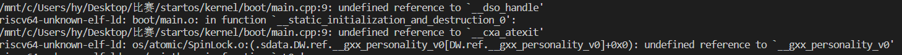

该文档记录我在开发该系统的过程中，所遇到的问题。

1、2021年4月19日 	汇编调用C++函数

​	汇编调用C++函数需要使用 extern "C" 不能使用 extern，这是因为C++为了函数的重载会将函数名和参数类型合在一起作为汇编符号，其具体符号和所使用的的编译器有关，可以通过nm -C xxx.o来查看符号表。

2、2021年4月21日 析构函数引起的符号未定义



定义类时不能定义析构函数:(，因为析构函数会涉及一些标准库。

解决方法：

重载new,delete运算符，并禁用RTTI和cxa-atexit，在g++中可以通过-fno-use-cxa-atexit，-fno-rtti来禁用相应的选项。

注意：如果不禁用RTTI，虚函数也不能够使用，会出现vtable未定义的情况，原因暂时不知道。

cxa-atexit函数主要是用来处理析构函数释放动态链接库的，cxa-atexit函数会调用__dso_handle(dynamic_shard_object)来进行释放。

3、2021年4月24日 	回车问题

在测试控制台的时候，发现k210和qemu的回车不一致，k210中回车键会换两行，而qemu中只会换一行，查阅相关资料后发现各个操作系统对回车符的处理不一样

```cmake
macOS:	 '\r'
linux:	 '\n'
windows: '\r\n'
```

我对换行键的处理时将'\r'替换为'\n'，这就会导致出现两次换行，在qemu中可能处理会将'\r\n'替换为'\n'，所以在qemu中不会出现这个问题

4、2021年5月1日 c++无法使用多态

​		这个是由于实例的虚函数表指针没有正常初始化，也就是该实例没有调用构造函数。一般只有全局对象才会发生这个，这主要是因为调用全局对象构造函数的runtime被禁用了。这个需要调用编译器提供的_init()函数来进行初始化。

5、tp寄存器被修改 5月15日

​		在进行测试的是否总是出现各种内存访问错误，然后在panic函数打印了当前运行的进程，然后发现每次运行的进程为空 ，不知道是什么原因引起的，刚开始以为内核栈溢出修改cpu数组的值，然后就增加了内核栈的大小，结果仍然会报错。后面发现单CPU运行时，就不会出现这个问题，然后后面就一直单CPU运行了:( 。

​		然后现在知道了qemu中可以查看运行信息，就又重新开始探索这个问题了。在查看寄存器信息的时候发现mhartid和 tp寄存器不一致，然后就检查了可能会修改 tp寄存器的地方，发现是在内核中断返回时，不应该加载 之前保存的tp寄存器。不然会导致tp寄存器和mhartid不一致。

qemu 调试指南:
  ctrl+a, c 进入命令行
  info registers 打印全部寄存器，包括控制寄存器
  info mem 打印虚拟地址，其对应的物理地址，还有权限。可用来查看那一段内存被映射了


refs:
  https://bitbashing.io/embedded-cpp.html
  https://wiki.osdev.org/Calling_Global_Constructors
  https://wiki.osdev.org/C++

